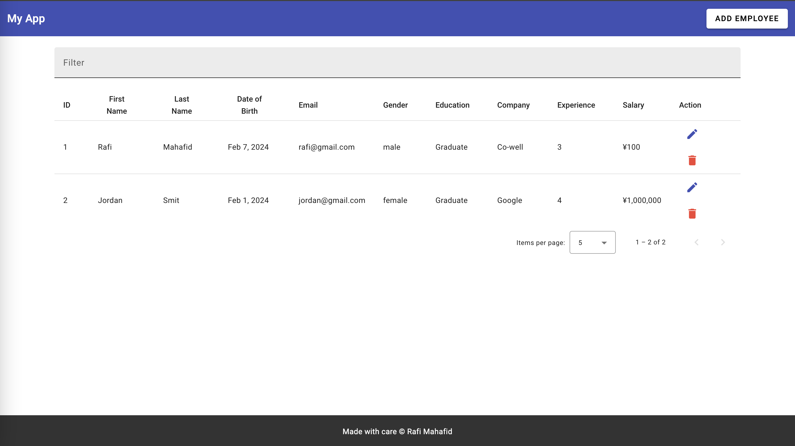
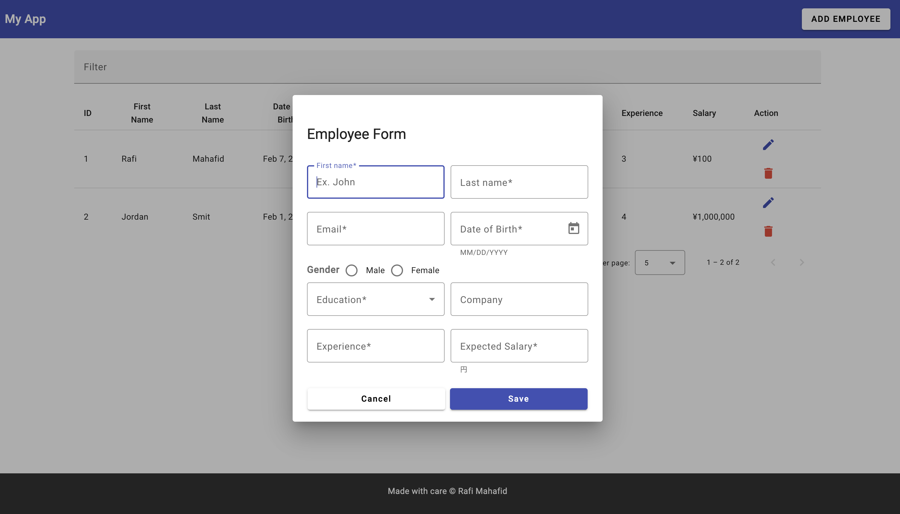
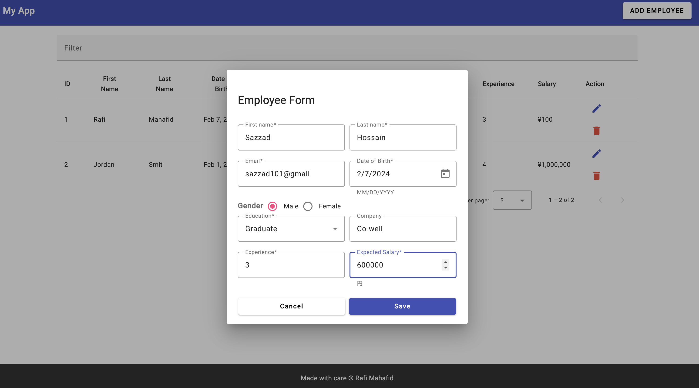
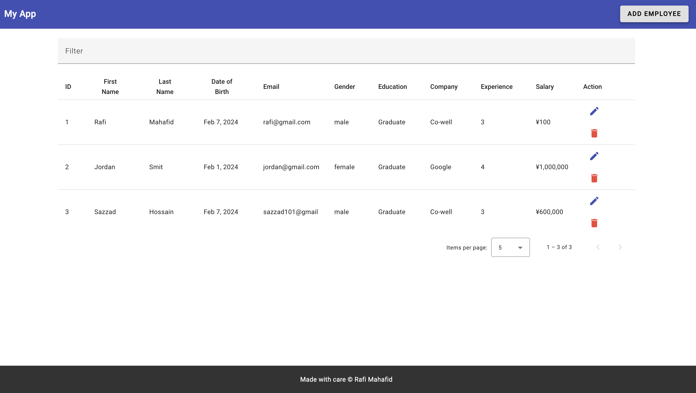
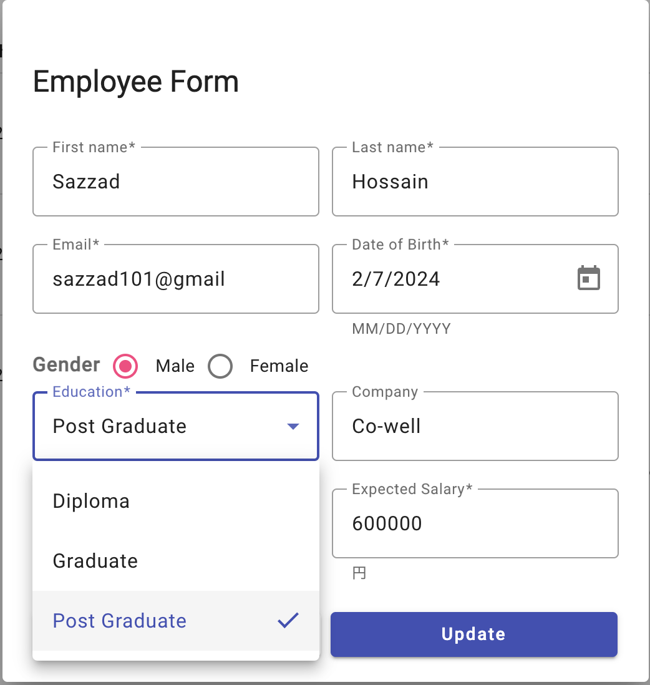
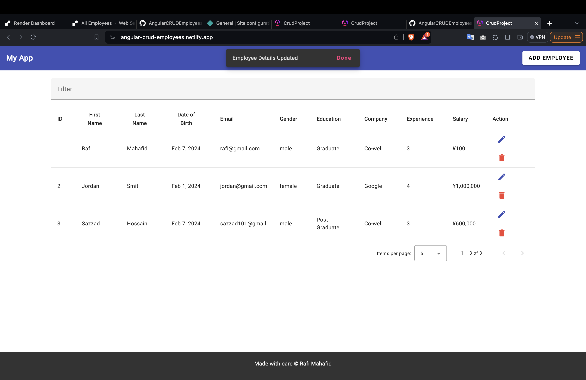

# 従業員管理システム

従業員管理システムへようこそ!
このアプリケーションを使用すると、従業員データに対して CRUD 操作 (作成、読み取り、更新、削除) を実行できます。

## ライブデモ

アプリケーションのライブデモをチェックしてください。 [従業員管理システム](https://angular-crud-employees.netlify.app/)

## 特徴

- **作成**: 新しい従業員をシステムに追加します。
- **読む**: 従業員のリストとその詳細を表示します。
- **更新**: 既存の従業員情報を編集します。
- **削除**: システムから従業員を削除します。

## 使用されている技術

- **Angular**: ユーザー インターフェイスを構築するためのフロントエンド フレームワーク。
- **JSON サーバー**: バックエンド API 呼び出しをシミュレートする軽量のモック サーバー。
- **Angular マテリアル**: 最新の応答性の高いインターフェイスを設計するための UI コンポーネント ライブラリ。

## スクリーンショット

### 1

### 2

### 3

### 4

### 5

### 6

